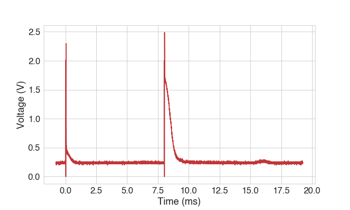
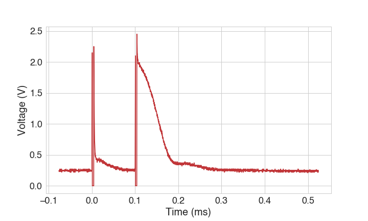

# Pulsed NMR Lab Logbook
The layout of this labbook is as follows: I have split this into 5 sections:

1.  **Theoretical Background**

    Background research + objectives + overview of lab procedure done prior to doing the lab.

2.  **Data Collection**

    This section is organized by the week of the lab. Dates and filenames are noted. 

3.  **Analysis**

    The section is organized by topics that were encountered. Dates are recorded for the duration of the problem.

4.  **Results**

    This section is organized by the procedure outlined in the lab manual. Questions in lab manual are answered here.

5.  **Conclusions**


A copy of this labbook can be found on my lab book site: [link](https://estherlin.github.io/enph352/lab2/lab2.html). All of the code I used for analysis, complete with documentation is also there. 

# Table of Contents

[TOC]

# Background

## Theory

This is basically a version of the theory section for the paper. 

Many nuclei, notably the proton, have spin angular momentum, and these magnetic moments will tend to align with an applied DC magnetic field. With the application of a radio frequency (RF) magnetic field pulse of radio, the net magnetization of a sample can be rotated to an arbitrary angle, from where it will precess while decaying back to equilibrium to re-align with the DC field. The timescales for growth toward equilibrium (parallel to the field) and decay of the transverse component of the magnetization are different. These relaxation times $T_1$ and $T_2$ can be used to characterize the sample, and can provide information about the nuclei’s environments.

Two spin states exist for the proton, spin up and spin down. When a sample containing protons is placed in a magnetic field, most of the spins of the protons will align with the magnetic field and occupy the lower energy state corresponding to the direction of the magnetic field. This will create a net magnetization $M_z$ of the sample in the same direction. This phenomena may also be explained with statistical mechanics, where at room temperatures, we expect our sample population to be aligned with the external magnetic field, which will result in a non-zero net magnetic moment.

For the following experiments, a pulsed NMR spectrometer was used. All of the coils (transmitter, receiver, magnetic field solenoid) are placed orthogonal to each other so they do not interfere. 

>   
>
>   System level diagram of pulsed NMR spectrometer. The inputs of the system are the timing and pulse parameters (number, duration, and delay time between the pulses, etc.) from the user. These inputs are given to the pulse programmer, which generates signals that are then sent through the transmitter coil that is wrapped around the sample. This generates the RF pulses that are orthogonal to the DC field from the magnetic coils. The DC magnetic field is generated by two permanent magnets outside the sample. The sizing of the magnetics are larger than the sample, to produce a field that is as homogeneous. A  receiver coil is wrapped around the sample to detect the precession of the sample nuclei in the plane orthogonal to the DC magnetic field. An oscilloscope is used to display and record the voltage signals from the receiver coil.

There are two types of relaxations involved in this decay, and a sample can be characterized by these two relaxation times. Spin-lattice relaxation $T_1$ is the relaxation time for the sample to decay back to equilibrium in the $z$ direction. The pulse sequence required to measure $T_1$ is first a $\pi$ rotation pulse, followed by a $\pi/2$ pulse. The equation for it is:
$$
M_z(t) = M_0(1-2e^{-\frac{t}{T_1}})
$$
$T_2$ relaxation is the time needed for the spins of a population to dephase from each other in the $xy$ plane. The pulse sequence required to measure $T_2$ is first a $\pi/2$ rotation pulse, followed by a repetition of $\pi$ pulses. The equation for it is:
$$
M_x(t) = M_0 e^{-\frac{t}{T_2}}
$$

## Objectives for Lab

- [ ]  To become familiar with NMR principles and techniques (eh)
- [ ]  Measure $T_1$, $T_2$ for a few samples like glycerin, mineral oil, and water

## Overview of Procedure for the Lab
0.  Getting started. 
      -   Turn on the magnet and water cooling. 
      -   CHECK THE TEMPERATURE OF THE NMR MAGNET THROUGHOUT THE LAB
1.  Get max signal from sample by adjusting the height of the sample in the coils
2.  Tune to Resonance. 
3.  Measure T1
4.  Measure T2


# Data Collection

##Week 1 [Feb. 11, 2020]

All data is stored under the ```data/lab2/week1/``` directory. 

**Getting started**

The NMR was turned on at 12:15. The previous student (Wilson) had found that the thing gets really hot. We need to cool the NMR with tap water. I proceeded to do that for an hour, until the NMR magnet felt cool to the touch.

**Single Pulse**

NMR Settings:

| Parameter       | Setting                           | Notes                                    |
| --------------- | --------------------------------- | ---------------------------------------- |
| A-width         | halfway                           | Is this a $\frac{\pi}{2}$?               |
| Mode            | Int                               | Automatic mode?                          |
| Repetition time | ~ 500 ms                          | time to let everything calm down. Can only do 1 s |
| Sync            | A                                 |                                          |
| A, B pulses     | On, Off                           |                                          |
| Sync out        | To scope's external trigger input | shooooot I need to review oscilloscopes  |
| A+B Out         | To scope's channel 1              |                                          |

Oscilloscope settings:

| Parameter      | Setting                |
| -------------- | ---------------------- |
| Trigger        | rise of the sunc pulse |
| sweep rate     | 2-10 us/cm             |
| vertical scale | 1 V/m                  |


Data collected (CH1: A+B, CH2: Detector)

| Parameter                                | Image                                    | Notes                                    |
| ---------------------------------------- | ---------------------------------------- | ---------------------------------------- |
| Standard parameters                      | ```standard_params.JPG```:  | With the A-width turned halfway, we see that  pulse width has time 15.4 us and pulse strength of 6.32 V |
| Changing A-width to one notch below the halfway | ```A-width to one notch below the halfway.JPG```: | pulse strength: 6.32 Vpulse width: 12.4 us |
| Change A-width to one notch above halfway | ```A-width to one notch above halfway.JPG```: | pulse strength 6.32 V and pulse width 19.6 us |
| Switch mode to Man                       | ```Switch mode to Man.JPG```: | When you press man, it just manually sends the pulse. Off otherswise. |
| Set the scope’s sweep rate to1ms/cm and repetition time to 10ms, then change the variable repetition time from 10% to 100%: 10% | ```10%repetition.jpg```: | pulse strength: 3.22V pulse width: 16 us, pulse spacing: 1.16 ms |
| Set the scope’s sweep rate to1ms/cm and repetition time to 10ms, then change the variable repetition time from 10% to 100%:100% | ```100%repetition.jpg```: | pulse spacing: 12.8 ms, pulse spacing:   |

*What is variable repetition time?*

**The Pulse Sequence**

Procedure

1.  Detector out: gives magnitude of the FID
2.  Mixer out: FID!!!

## Week 2 [Feb. 25, 2020]

data is storeed in ```data/lab2/week1/```

**Tuning to Resonance [Feb. 25, 2020]**

For each sample, we have to tune to resonance. Before I started, the frequency was 15.4 MHz. To tune to resonance, you have to use a $\frac{\pi}{2}$ pulse, which corresponds to a ~20% A-width as mentioned in the lab manual. Resonance is a property of the sample, and you need to adjust the sample to get max signal. My procedure for doing this:

1.  load in sample (the mineral oil)
2.  Hook the osciloscope up, with CH1 being the mixer out and CH2 being detector out. Detector out gives the envelope of the FID while mixer out gives the actual FID.
3.  Adjust height with o-ring to get max signal. 
4.  Tune frequency with the coarse and fine adjustments such that no beats are seen. UPDATE: sometimes it's better to be slightly off resonance. This allows us to see the pulses better. 

This is what resonance looks like:

>   
>
>   Resonance looks smooth

**Spin-Lattice Relaxation Time T1**

Reduce the FID to roughly 1/2 of the largest value, which I measured to be 480mV. I measure 10 ms. I measured:

-   At 992 us spacing, the voltage difference is 360 mV

**T2 Measurement:**

Need to actually increase the delay time to 3ms to see the full echo.

>   
>
>   This is what a spin-scho signal is supposed to look like!!! Wow this took me a while to get. This is done with the mineral oil. Before, when my delay wasn't long enough, this is what I was seeing: 
>
>   
>
>   Half of the echos are cut off and I wasn't acquiring the full signal.

Here, I can do some rough measurements to show that the echos are dying off exponentially

-   0 ms: 680 mV
-   3ms: 540
-   6ms: 350
-   9ms: 210
-   12ms: 110

Oh no. To store data, I'll need to fire up the computer. So I'll do that next week. 

## Week 3 [Mar. 3, 2020]

All data is stored under the ```data/lab2/week3/``` directory. 

**Paper Discussion**

I need a methods and results section with discussion. And then do discussion to talk about uncertainties and reason about results. 

**Measuring T2 of Water**

1.  Tune to resonance. 

-   tau = 3.5 ms
-   freq = 15.24334
-   10 repetitions
-   repetition time = 5 s
-   filename: water_T2.dat

**Measuring T1 of Water**

grab a single FID for each delay time. 

-   water_T1_tau-1: 3.5 ms (old tho)
-   water_T1_tau-2: 3.3 ms
-   water_T1_tau-3: 3.1 ms
-   water_T1_tau-4: 3.7 ms
-   water_T1_tau-5: 3.9 ms
-   water_T1_tau-6: 3.5 ms
-   water_T1_tau-7: 2.5 ms
-   water_T1_tau-8: 1.5 ms
-   water_T1_tau-9: 4.5 ms
-   water_T1_tau-10: 5.5 ms

**Measuring T1 of Mineral Oil**

Tuned to resonance

-   tau = 
-   freq = 15.24142
-   repetition: 500ms

The files:

-   mineral_T1_tau-1: 0.1 us (100 ms)
-   mineral_T1_tau-2: 0.11 us (110 ms)
-   mineral_T1_tau-3: 0.12 us (120 ms)
-   mineral_T1_tau-4: 0.14 us
-   mineral_T1_tau-5: 0.2 us

Oh noooo. Just realized all of this mineral oil data is useless because I didn't calibrate my pulses. Okay so the procedure for doing these calibrations is to tune the $\pi$ and $\frac{\pi}{2}$ separately on A and B. Right now, I'm doing the $\pi$ pulse on A. Whichever pulse you are on, trigger on that to see it on the scope. 

Okay, so to restart… Let's just do glycerin well. 

**Tune to Resonance for Glycerin**

The resonant frequency was tuned to be at at 15.24442 MHz. This is what my resonance looks like:


**T2 measurement for Glycerin**

List of experiments done with CPMG to find T2:

| Filename                | Parameters                               | T2 Measured [s] | Image                                    |
| ----------------------- | ---------------------------------------- | --------------- | ---------------------------------------- |
| ```glycerol-t2-1.DAT``` | delay: 6.01 ms, M-G on, repetition time 600 ms , frequency = 15.24442 MHz, 21 pulses | 0.096           |  |
| ```glycerol-t2-2.DAT``` | Same experiment as before, delay: 6.01 ms, M-G on, repetition time 600 ms , frequency = 15.24442 MHz, 21 pulses | 0.094           |  |
| ```glycerol-t2-3.DAT``` | delay: 6.01 ms, M-G off  repetition time 600 ms  frequency = 15.24442  21 pulses | 0.059           |  |
| ```glycerol-t2-4```     | delay: 4.01 ms  M-G on  repetition time 600 ms  frequency = 15.24442  21 pulses | 0.066           |  |
| ```glycerol-t2-5```     | delay: 2.01 ms,  M-G on,  repetition time 600 ms,  frequency = 15.24442,  21 pulses | 0.069           |  |
| ```glycerol-t2-6```     | delay: 8.01 ms  M-G on  repetition time 600 ms  frequency = 15.24442  21 pulses | 0.077           |  |
| ```glycerol-t2-7```     | delay: 8.01 ms, M-G on, repetition time 600 ms, frequency = 15.24442, 21 pulses | 0.075           |  |

And example of what my spin echo looks like for experiment number 7 on the first list above:

>   
>
>   CH1 is the spin-echo and CH2 is the magnitude .

I tried the M-G on switch by comparing ```glycerol-t2-3``` results with ```glycerol-t2-1``` and ```glycerol-t2-2```. The T2 measured in ```glycerol-t2-3``` is much lower. This makes sense, because when M-G is on, it reduces the error. 

So I'm pretty confused by this. It seems like my T2 changes based on delay time. At least it changes consistently! ```glycerol-t2-1``` and ```glycerol-t2-2``` are the same experiement (same parameters) and their values of T2 are pretty similar. ```glycerol-t2-6``` and ```glycerol-t2-7``` are also the the same experiment and their T2 values are similar too. Meanwhile, the T2 values measured with a delay of 2 or 4 ms is also different. If I am to trust any of these measurements, I would trust the one with the 8ms delay time. THis is because more taime has passed and hopefully less interactions will be taken into account. 

>   
>
>   T2 = 75 ms of trial 6. 

Talked to Dr. Reinsberg. There is another way we can find T2. We can use only one $\pi$ pulse but increase delay time until you get a minimum signal. Remeber to trigger on B! The resonant frequency is still at 15.24442 mHz.

1.  glycerol-t2-8: delay 6.01 ms
2.  glycerol-t2-9: delay 10.01 ms
3.  glycerol-t2-10: delay 14.0 ms
4.  glycerol-t2-11: delay 20.0 ms
5.  glycerol-t2-12: delay 50.0 ms
6.  glycerol-t2-13: delay 45.0 ms
7.  glycerol-t2-14: delay 48.0 ms
8.  glycerol-t2-15: delay 70.0 ms

Around a delay of 70 ms, I would say that the FID magnitude drops to less than a third of the original magnitude. So I'd say that the T2 is around 70 ms, with corresponds to our measurement above.

A scaling of $1$ V was used on the oscilloscope, and the oscilloscope was able to output voltage readings on the order of 0.01 V. Applying this uncertainty of $\pm 0.01$ V to our fit, a variation of $\pm 5$ ms was found in the exponential fit. So, this undertainty of 5 ms should be applied to all of our time constant measurements.

**T1 measurements of Glycerin**

Resonance at: 15.24342 MHz. This was done slightly off resonance to see a few wiggles, although the difference is so small I don't see a difference.

| Filename                 | $\tau$ [ms] | FID Max Value | Image                                    |
| ------------------------ | ----------- | ------------- | ---------------------------------------- |
| ```glycerol-t1-1.DAT```  | 6           | 1.72          |  |
| ```glycerol-t1-2.DAT```  | 8           | 1.6           |  |
| ```glycerol-t1-3.DAT```  | 0.1         | 1.92          |  |
| ```glycerol-t1-4.DAT```  | 0.2         | 1.87          |  |
| ```glycerol-t1-5.DAT```  | 0.4         | 1.78          |                                          |
| ```glycerol-t1-6.DAT```  | 0.6         | 1.73          |                                          |
| ```glycerol-t1-7.DAT```  | 0.8         | 1.64          |                                          |
| ```glycerol-t1-8.DAT```  | 1.0         | 1.52          |                                          |
| ```glycerol-t1-9.DAT```  | 2.0         | 1.07          |                                          |
|                          |             |               |                                          |
| ```glycerol-t1-11.DAT``` | 10.0        | 1.25          |                                          |
| ```glycerol-t1-12.DAT``` | 20.0        | 0.56          |                                          |

The lower times are basically useless, I need data points from longer times. I'm so dumb, I should have looked at a wider range of time values. sigh. 

Using the data points from 0.1, 1, 10, 20 ms, I fit to our differential equation:

>   
>
>   Magnetization vs. delay time plot of glycerin used to extract $T_1$ relaxation. $T_1$ is found to be 50 ms. Damn, I was looking in the wrong region for T1. I should have been looking for much greater values. Maybe I should do more data points if it's not too late.

The same uncertainty of $5$ ms applies, since we're still dealing with the exponential fits.

# Conclusions 

So, I'm pretty sure my T1 measurement of glycerin is wrong. I need more data points with longer delay times to get a more accurate value. I am more confident about my T2 experiment, just because I did it so many times. If I wasn't so distracted for this lab, it would have been great to compare my results with the different materials. I guess I can still compare the T2 measurements of water with that of glycerin. 

When comparing with the long $T_1$ and $T_2$ values of water which are on the order of seconds, we can see that the protons on glycerin have less rotational freedom compared to those on water. This is as expected, since glycerol is a larger molecule than water and has three hydroxide groups that can greatly limit the rotations of protons compared that of protons on a single oxygen in water. 

There are several sources of error in this experiment. First, there is the uncertainty in the oscilloscope measurements. This has been taken into account by varying exponential fits to determine the greatest variance in the relaxation time constants. Another major contributor is the dependence of relaxation times on the temperature of the sample. Over the course of the experiments, the spectrometer is hooked up to a tap water source, which cools the magnetic. Occasionally, the pressure in the tap water source fluctuates, which will also cause the temperature of spectrometer to vary. It could be possible that irradiating a sample rapidly and continuously with the RF pulses may raise its temperature as well. In the future, this experiment should be repeated as quickly as possible to avoid errors. 

## Abstract

This experiment utilizes pulsed nuclear magnetic resonance to determine characteristic spin-relaxation properties of glycerin. A quick, order-of-magnitude estimate was used to measure the Spin-Lattice Relaxation Time $T_1$ of our sample to be $50 \pm 5$  ms. The Spin-Spin Relaxation Time $T_2$ was observed with the spin-echo technique, which we measured to be $75 \pm 5$  ms. The $T_1$ and $T_2$ values of water is several orders of magnitude greater ($T_1 \approx 3s$) than our measurement. This is expected, since the protons on glycerin have less rotational freedom compared to those on water due to greater steric hindrance and number of nucleophile sites. 