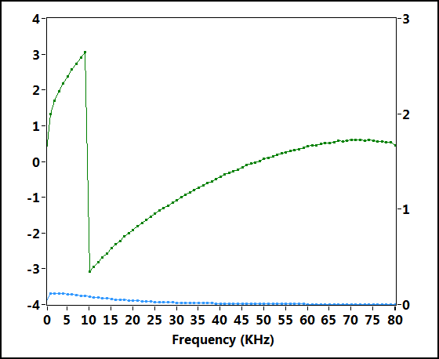
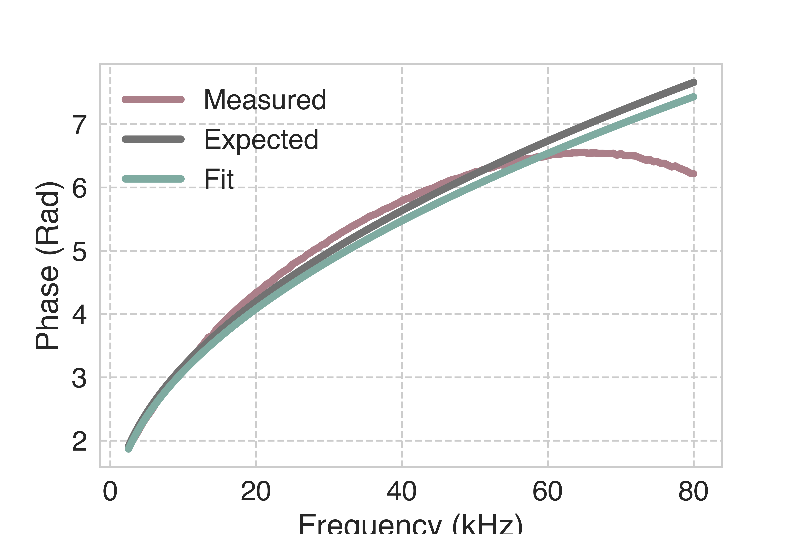
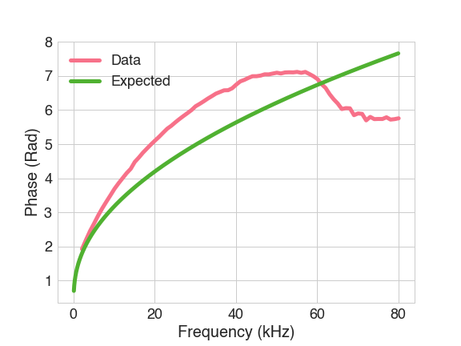

# Lab 3: Electromagnetic Skin Depth of Metals Labbook

## Table of Contents

[TOC]

## Week 1 [Mar. 10, 2020]

Data is saved in the folder ```data/lab3/```.

**Step 1**

Opening up the Skin Depth LabView program, we follow the instructions on the screen to set the parameters for our equipment.

**Step 2**

We measure the inner and outer radii of the pipes. Oh nooo, there are 3 different pipes and its hard to tell which is aluminum and which is steel. Measurements made:

| Pipe     | $2R_1$ (inner) $\pm 0.01$ [mm] | $2R_2$ (outer) $\pm 0.20$ [mm] | Thickness $R_2 - R_1$ $\pm 0.01$ [mm] |
| -------- | ------------------------------ | ------------------------------ | ------------------------------------- |
| Aluminum | 22.25                          | 25.40                          | 1.60                                  |
| Copper   | 25.44                          | 28.62                          | 1.55                                  |

Measuring the outside diameter directly is the least accurate way to measure. It would be better to find $R_2$ from using the inner diameter and the thickness. However, in our calculations, we never need the radii separately… LOL I'm dumb. 

The high frequency approximation breaks down when $k_0(R_2 - R_1)\lessapprox 1$. Plugging in $k_0 = \sqrt{\frac{\omega \sigma \mu}{2}}$, we find that the frequency approximation breaks down for angular frequencies
$$
\omega \lessapprox \frac{2}{\sigma \mu}\bigg(\frac{1}{R_2-R_1}\bigg)^2
$$
Using values of conductivity from <<https://www.engineeringtoolbox.com/resistivity-conductivity-d_418.html>>, and using the approximation $\mu \approx \mu_0 = 4π \times10^{−7} (H/m) = 4π \times10^{−5} (H/cm)$, I find:

| Pipe     | Electrical Conductivity [$1/\Omega\cdot cm$] | Cutoff Frequency $\omega$ [rad/s] | Cutoff Frequency $f$ [Hz] |
| -------- | ---------------------------------------- | --------------------------------- | ------------------------- |
| Aluminum | 3.77 x 10^5^                             | 1.649 x 10^14^                    | 2.625 x 10^13^            |
| Copper   | 5.95 x 10^5^                             | 1.113 x 10^14^                    | 1.772 x 10^13^            |

These frequencies are crazy high. So unless the frequency generator can go up to these speeds, we're definitely going to have attenuation.

Calculating the uncertainty in frequencies, I find that the uncertainties are super small, $\pm$ 67 MHz for Aluminum and $\pm$ 43 MHz for Copper. They are basically negligble for my applications.

Note, we have our maxwell's equations:


.png)

**Step 3**

| Material | Filename                                 | Results                                  |
| -------- | ---------------------------------------- | ---------------------------------------- |
| Air      | ```air-20200310.DAT```                   |  |
| Aluminum | ```al-20200310.DAT```, ```al-20200310-amp.DAT``` | This is the original. This is the data taken at higher frequencies with increased gain. |
| Copper   | ```cu-20200310.DAT```, ```cu-20200310-amp.DAT``` | This is the original. This is the data taken at higher frequencies with increased gain. |

For copper, in frequencies above 60kHz, everything degenerated into noise. Set Vpp to 8 now. 50-80kHz. I'll also just redo the aluminum. The redone filenames are listed, with -amp attached to the name. 

I think I'm done data collection! Yay!

## Week 2 [Mar. 17, 2020]

**Step 4**

Calculate the expected values of the amplitude ratio and phase difference at each frequency, and compare them to their measured values.

A copy of our equations:
$$
\begin{aligned}
\frac{H_{i}}{H_{o}} &=\rho e^{i \phi} \\
\rho &=2 \sqrt{\frac{R_{2}}{R_{1}}}\left\{\frac{e^{-k_{o}\left(R_{2}-R_{1}\right)}}{\sqrt{1+R_{1} k_{o}+\frac{R_{1}^{2} k_{0}^{2}}{2}}}\right\} \\
\phi &=k_{o}\left(R_{2}-R_{1}\right)+\arctan \left(\frac{R_{1} k_{o}}{2+R_{1} k_{o}}\right) \\
k_{o} &=\sqrt{\frac{\omega \sigma \mu}{2}}
\end{aligned}
$$
where:
$H_{o}=$ magnetic field outside the pipe 

$H_{i}=$ magnetic field inside the pipe

$R_{1}=$ inner radius of the pipe 

$R_{2}=$ outer radius of the pipe 

$\sigma=$ conductivity of the metal $\left(\approx 3 \times 10^{5} \frac{1}{\Omega \cdot \mathrm{cm}} \text { for } \mathrm{Al}\right)$
$\mu=$ permeability of the metal 

$\omega=$ angular frequency

>   The expected value plots are:
>
>   |  |
>   | ---------------------------------------- |
>   | Plot of the amplitude ratio.             |
>
>   |  |  |
>   | ---------------------------------------- | ---------------------------------------- |
>   | Plot of the phase difference.            | Plot of the phase difference divided by $\pi$. |
>

The code used to generate them:

```matlab
close all
clf
%% Constants
sigma_Al = 3.77e5;
R1_Al    = 22.25/2/1000; 
R2_Al    = 25.40/2/1000; 

sigma_Cu = 5.95e5; 
R1_Cu    = 25.44/2/1000; 
R2_Cu    = 28.62/2/1000; 
mu       = pi*4e-5;

%% Functions
k0     = @(f, sigma)  sqrt(2*pi*sigma*mu*0.5.*f);
amp_r  = @(k0, R1, R2) 2*sqrt(R2/R1).*exp(-(R2-R1).*k0)./sqrt(1+R1.*k0+0.5.*(R1.*k0).^2);
p_diff = @(k0, R1, R2) (R2-R1).*k0+atan(R1.*k0./(2+R1.*k0));

%% Plot
f = linspace(100,80000,80000);

figure(1)
semilogx(f, amp_r(k0(f, sigma_Al), R1_Al, R2_Al));
hold on;
semilogx(f, amp_r(k0(f, sigma_Cu), R1_Cu, R2_Cu));
grid on;
legend('Aluminum','Copper');
xlabel('Frequency (Hz)');
ylabel('Ratio');

figure(2)
plot(f, p_diff(k0(f, sigma_Al), R1_Al, R2_Al));
hold on;
plot(f, p_diff(k0(f, sigma_Cu), R1_Cu, R2_Cu));
grid on;
legend('Aluminum','Copper');
xlabel('Frequency (Hz)');
ylabel('Phase (rad)');

figure(3)
plot(f, p_diff(k0(f, sigma_Al), R1_Al, R2_Al)./pi);
hold on;
plot(f, p_diff(k0(f, sigma_Cu), R1_Cu, R2_Cu)./pi);
grid on;
legend('Aluminum','Copper');
xlabel('Frequency (Hz)');
ylabel('Phase/$\pi$','Interpreter',"latex");
```

##Week 3 [Mar. 24, 2020]

First, we need to fix our data for the aluminum and copper case. This can be done by replacing portions in the less finely spaced data with the finely spaced data in the -amp files. The -amp files all started at 50kHz. So we replace the original files with the new data after 50kHz. 

Next, I plot the data against the expected curve, fixing the 2pi jump in the machinery. 

|  |  |
| ---------------------------------------- | ---------------------------------------- |
| Plot of phase for Aluminum               | Plot of amplitude for Aluminum           |

|  |  |
| ---------------------------------------- | ---------------------------------------- |
| Plot of phase for Copper                 | Plot of amplitude for Copper             |

The amplitude data seems quite off. I think I'm going to stick with fitting the phases.

So, the original phase equation seems like a nasty one to fit. I'll be fitting to $\rho^2$:
$$
\rho^2 = 4\frac{R_1}{R_2} \frac{e^{-2k_0(R_2-R_1)}}{(R_1k_0+1)^2+1}
$$
